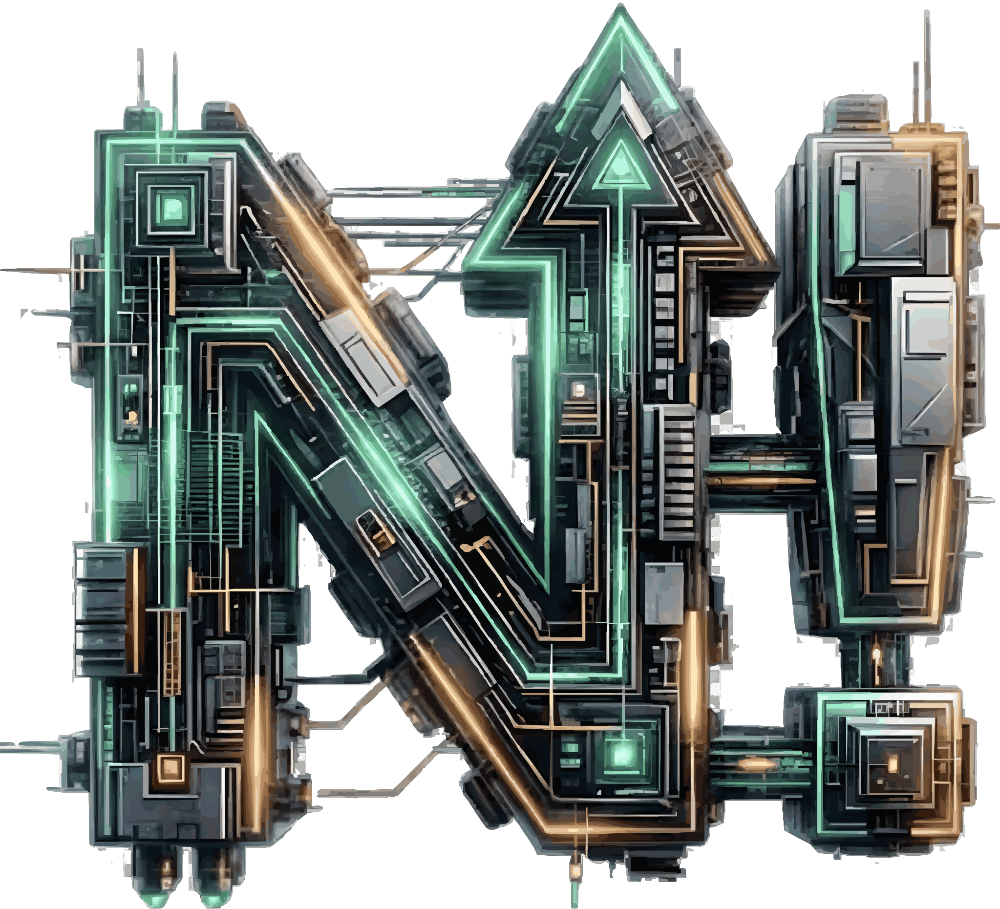

# Citadel of nFactorials — Rick & Morty Explorer




## Краткое описание проекта

Citadel of nFactorials — веб‑приложение по вселенной «Рик и Морти» для поиска персонажей, эпизодов и локаций. В проекте есть AI‑помощник Truth Tortoise, детальные страницы персонажей и эпизодов, пагинация и темизация.

**Почему «Citadel of nFactorials»?**
1. **Название:** *nFactorials* — это математическое понятие **факториала ($n!$)**, произведение всех целых чисел от 1 до *n*. Это символ **взрывного роста** и сложности, что перекликается с идеей бесконечной мультивселенной и быстрым ростом.
2. **Цитадель:** отсылка к *Citadel of Ricks* — гигантский межпространственный мегаполис, созданный Риками из разных вселенных. Изначально Цитадель управлялась Советом Риков — элитой «самых умных Риков». Это место, где у Риков был доступ к информации. собираются самые умные существа во вселенной.
3. **Логотип:** Массивная монолитная буква **«N!»**, сконструированная как высокотехнологичная орбитальная станция или сложная микросхема. Она символизирует твердость знаний и сложность мироздания и отсылает к цитадели. 
* **Скрытый символ (!):** В геометрию правой части буквы вписан **силуэт восклицательного знака**. Вместе с буквой N это образует математический символ Факториала ($n!$) — знак стремительного, взрывного роста.
* **Вектор вверх:** Центральная диагональ образует стрелку, устремленную ввысь, что означает постоянный прогресс.
* **Палитра:**
    * **Мятный неон:** Потоки данных и энергия порталов, но в более строгом и современном исполнении, чем классический «токсичный зеленый».
    * **Медь и Сталь:** Придают индустриальный, инженерный вид, заземляя фантастику в реальность.

**Почему черепаха?** Truth Tortoise — метафора «медленной, но верной» правды: AI‑помощник отвечает спокойно и медленно. Визуально черепаха поддерживает sci‑fi эстетику проекта, а также есть отсылка к серии *Morty’s Mind Blowers* (S03E08), где Рик предупреждает Морти не смотреть ей в глаза, иначе узнаешь всё. Также и тут, черепаха правды, которая поведает вам правду о вселенной Рик и Морти.

---

## Деплой

Vercel: https://the-citadels-of-nfactorials.vercel.app/

---

## Установка и запуск

```bash
npm install
npm run dev
```

Открыть: `http://localhost:3000`

---

## Выполнение требований задания

### ✅ Уровень 1
- [x] Страница поиска с удобным интерфейсом
- [x] Логичная структура компонентов (см. Архитектура)

### ✅ Уровень 2
- [x] Собственный backend над Rick and Morty API (`/api/characters`, `/api/episodes`, `/api/locations`)
- [x] Роутинг между страницами (поиск, детали персонажа, детали эпизода)
- [x] Пагинация для всех списков

### ✅ Уровень 3
- [x] Деплой на Vercel: https://the-citadels-of-nfactorials.vercel.app/

### ✅ Бонусный уровень
- [x] Светлая/тёмная темы с сохранением выбора
- [x] Интеграция AI (Truth Tortoise через OpenAI API)
- [x] Лоадеры и скелетоны

---

## Архитектура и структура проекта

### Структура файлов
```
app/
├── (pages)/                  # UI-страницы
│   ├── page.tsx              # поиск персонажей
│   ├── characters/[id]/      # детали персонажа
│   ├── episodes/page.tsx     # список эпизодов
│   ├── episodes/[id]/        # детали эпизода
│   ├── locations/page.tsx    # список локаций
│   └── truth-tortoise-ai/    # AI hub
├── api/                      # серверные endpoints
│   ├── characters/           # /api/characters, /api/characters/[id]
│   ├── episodes/             # /api/episodes, /api/episodes/[id]
│   ├── locations/            # /api/locations
│   └── ai/                   # /api/ai
└── layout.tsx

components/
├── ui/                       # переиспользуемые UI элементы
├── features/                 # бизнес‑компоненты
│   ├── characters/
│   ├── episodes/
│   ├── locations/
│   └── ai/
└── layout/                   # Header/Footer/Theme/Language

lib/
├── api/                      # клиентские обёртки
├── data/                     # локальные данные (эпизоды, переводы)
├── hooks/                    # кастомные хуки
└── i18n/                     # словари и провайдер

public/
├── citadel.svg               # логотип
├── portal-cursor.gif         # курсор-портал
└── truth-tortoise-hero.png   # изображение Truth Tortoise

types/
└── index.ts                  # общие TypeScript типы
```

### Принципы

1. **Single Responsibility**: каждый компонент решает одну задачу.
2. **Композиция**: UI‑примитивы переиспользуются во всех фичах.
3. **Container/Presentational**: контейнеры управляют данными, презентационные компоненты — только рендер.
4. **Custom Hooks**: повторяющаяся логика вынесена в `lib/hooks`.

---

## Процесс проектирования и разработки

Проект собирался примерно за **3 ночи**. Логика была такой:

1. **Скелет приложения**: определил страницы (поиск, детали, AI‑хаб) и сущности (персонажи, эпизоды, локации).
2. **Компонентная структура**: выделил UI‑примитивы и feature‑компоненты, чтобы масштабировать интерфейс.
3. **Серверные API**: добавил свои `/api/*` роуты, чтобы все внешние сервисы вызывались с сервера.
4. **UI и UX**: пагинация, скелетоны, темы, минималистичная навигация.
5. **AI‑интеграция**: Truth Tortoise AI для лора и дополнительных сведений.
6. **Описание эпизодов**: добавил локальный JSON с описаниями, чтобы не зависеть от runtime‑скрейпа.

---

## Уникальные подходы и методологии

- **Truth Tortoise AI** как брендированный помощник, встроенный в интерфейс.
- **Локальный кеш описаний эпизодов** (из Wikipedia) для стабильности и скорости.
- **Серверные прокси‑роуты** для всех внешних API — соответствует требованиям безопасности.
- **Portal Cursor**: кастомный курсор‑портал с эффектом перехода по навигации.
- **Multiverse Character Variants**: быстрый просмотр альтернативных версий персонажа в деталях.
- **Переключение языка (EN/RU/KK)**: интерфейсные тексты и локализованные имена персонажей.

---

## Компромиссы и технические решения

### Кеширование описаний эпизодов
**Решение**: локальный JSON (`lib/data/episode-descriptions.json`)  
**Альтернатива**: live‑скрейп Wikipedia  
**Почему так**: стабильность, скорость, меньше внешних зависимостей  
**Trade‑off**: требуется ручное обновление при новых эпизодах

### AI‑интеграция
**Решение**: ограничение длины ответа (`max_output_tokens`)  
**Почему**: контроль расходов и скорости  
**Trade‑off**: иногда ответы короче желаемого

### Локализация
**Решение**: ручной словарь имён на основе озвучки Сыендука  
**Альтернатива**: авто‑перевод через AI  
**Почему**: сохранение локализованных имён  
**Trade‑off**: неполное покрытие

### Portal Cursor
**Решение**: эффект активен только на ссылках в шапке и отключается вручную  
**Альтернатива**: глобальный эффект на всех кликах  
**Почему**: стабильная производительность и меньше отвлечения  
**Trade‑off**: меньше “магии” за пределами навигации

### Серверные API‑роуты
**Решение**: Next.js API Routes  
**Почему**: проще деплой, один проект, безопасность ключей  
**Trade‑off**: меньше гибкости, чем отдельный backend

---

## Известные проблемы и планы улучшений

### Текущие проблемы
1. **Локализация имён**: не все персонажи сопоставлены с локализованными именами.
2. **Переводы эпизодов и локаций**: часть данных остаётся только в английском виде.
3. **Поиск**: API не поддерживает fuzzy‑поиск, запросы должны совпадать точнее.
4. **Логотип**: слишком тяжелый логотип, немного выбивается из общей концепции.
5. **Описание эпизодов**: на данный момент не корректно берется инфомрация из wikipedia. 

### Планы на будущее
- Фильтры по статусу/виду персонажей
- Избранное (localStorage)
- Улучшение эффекта перехода и использование portal cursor
- Тесты

---

## Технический стек и почему он выбран

- **Next.js (App Router)** — позволяет объединить UI и серверные API в одном проекте.
- **TypeScript** — уменьшает количество ошибок и упрощает поддержку.
- **Tailwind CSS** — быстрое развитие интерфейса без лишних CSS‑слоёв.
- **Rick and Morty API** — основной источник данных.
- **OpenAI Responses API** — для AI‑помощника Truth Tortoise.

Выбор стека основан на скорости разработки, удобстве серверной логики и поддержке современной архитектуры интерфейсов.

---

## Внешние сервисы (server‑side only)

Все внешние API вызываются **только с серверной части**:

- `/api/characters`, `/api/episodes`, `/api/locations` → Rick and Morty API
- `/api/ai` → OpenAI Responses API

---

## API Endpoints

### Characters
```bash
GET /api/characters?page=1&name=rick
```

### Episodes
```bash
GET /api/episodes?page=1&name=rick
GET /api/episodes/[id]
```

### Locations
```bash
GET /api/locations?page=1&name=earth
```

### AI Chat
```bash
POST /api/ai
Content-Type: application/json

{ "prompt": "Tell me about Morty Smith" }
```

---

## Примечание по описаниям эпизодов

Описания эпизодов хранятся локально в:

- `lib/data/episode-descriptions.json`

При необходимости можно пересгенерировать данные.

---

## Благодарности и ресурсы

- Rick and Morty API — основной источник данных
- Wikipedia — описания эпизодов
- OpenAI — AI‑помощник Truth Tortoise (gpt4 mini)
- Vercel — платформа для деплоя
- Озвучка Сыендук — референс для русских имён

---

## Репозиторий

Проект размещён в **публичном GitHub‑репозитории**. Zip‑архивы не используются.
